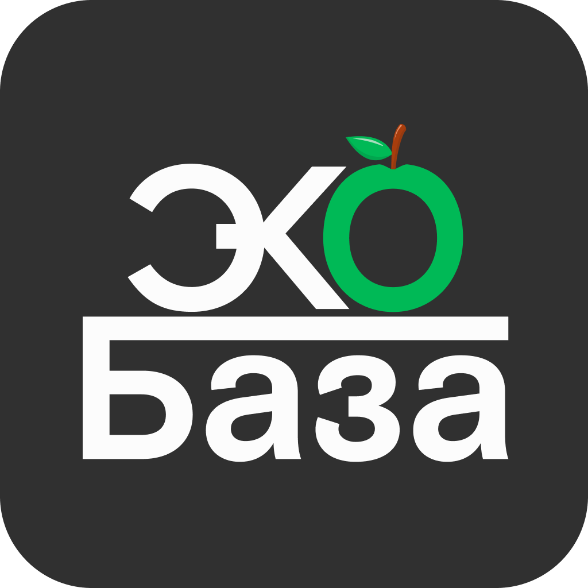
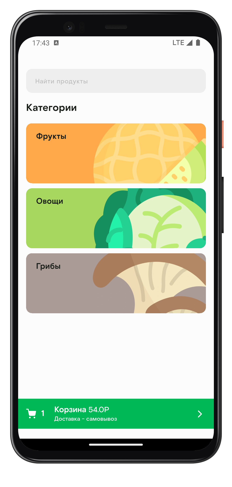
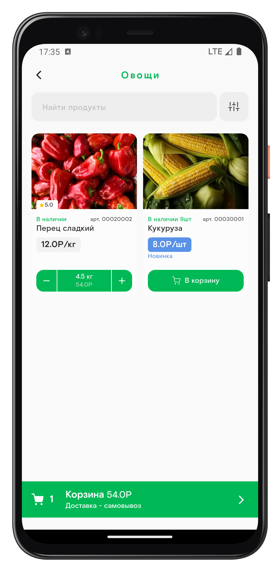
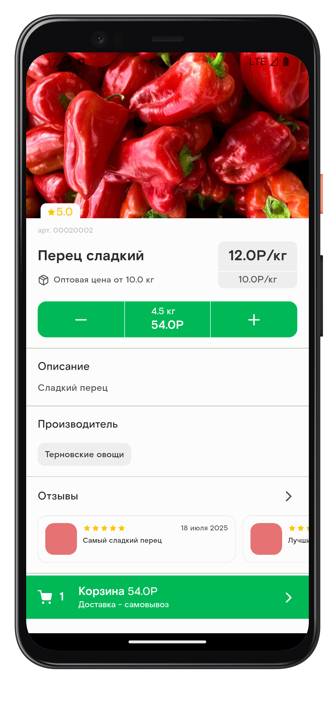
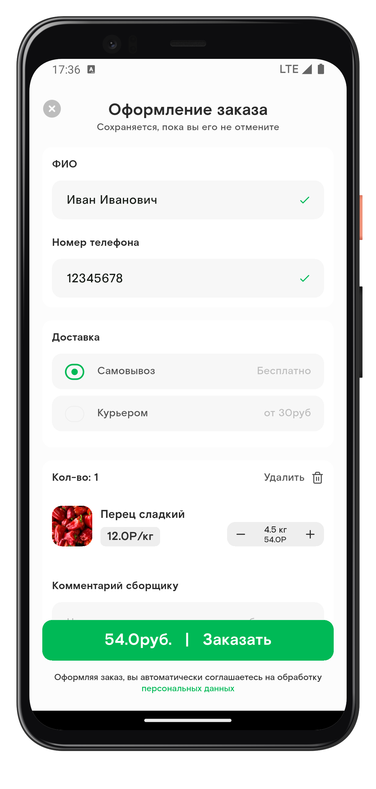

<p align="center" style="margin-bottom: 4px; margin-top: 0px">
	
</p>

Ecobaza(dorimol) — мобильное приложение на Flutter для онлайн-рынка ПМР. В проекте используются современные подходы к архитектуре, управление состоянием через BLoC, DI через get_it, а также интеграция с REST API через Dio и Retrofit.

|  |  |
| :------------: | :------------: | 
|  |  |
 

## Требования

- Flutter SDK >= 3.8.0
- Dart >= 3.8.0
- Android Studio / VS Code / Xcode (для соответствующих платформ)
- Поддержка платформ: Android, iOS

## Быстрый старт

1. Клонируйте репозиторий:
	 ```sh
	 git clone <repo-url>
	 cd dorimol
	 ```

2. Установите зависимости:
	 ```sh
	 flutter pub get
	 ```

3. Запустите приложение:
	 ```sh
	 flutter run
	 ```

## Структура проекта

- `lib/` — основной исходный код приложения  
  - `screens/` — экраны приложения  
  - `theme/` — тема и стили  
  - `widgets/` — переиспользуемые виджеты  
  - `api/` — модели и клиент для работы с API  
  - `data/` — константы, конфигурации, утилиты  
  - `router/` — маршрутизация приложения  

## Основные зависимости

- [flutter_bloc](https://pub.dev/packages/flutter_bloc) — управление состоянием
- [get_it](https://pub.dev/packages/get_it) — DI
- [dio](https://pub.dev/packages/dio), [retrofit](https://pub.dev/packages/retrofit) — работа с API
- [auto_route](https://pub.dev/packages/auto_route) — роутинг
- [talker_flutter](https://pub.dev/packages/talker_flutter) — логирование

## Сборка и запуск на разных платформах

- **Android/iOS:**  
	`flutter run` или используйте IDE.

## Переменные окружения

Создайте файл `.env` в корне проекта и добавьте необходимые переменные:
```
API_URL=https://api.example.com
```
## Соглашения по синтаксису и стилю

- Конструкторы классов размещайте в начале класса.
- Импортируйте пакеты всегда через абсолютный путь: `package:project/...`.
- Для цветов используйте полные шестнадцатеричные значения: `Color(0xFFxxxxxx)`.
- Имена файлов — только в нижнем регистре и через подчеркивание: `my_widget.dart`.
- Следуйте правилам, заданным в [analysis_options.yaml](analysis_options.yaml).

Для автоматической проверки соблюдения стиля используйте команду:
```sh
flutter analyze
```

## Контакты

Вопросы и предложения — пишите в Issues или напрямую команде.